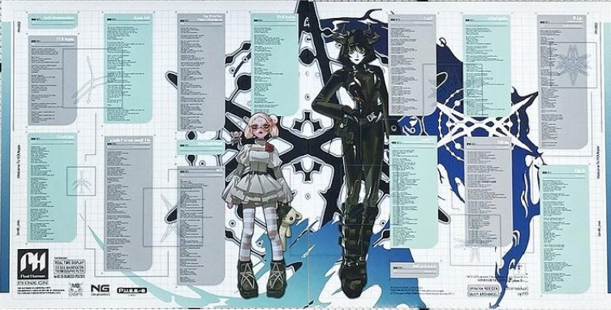

⠀⠀⠀⠀⠀⠀⠀⠀⠀⠀⠀⠀⠀⠀⠀⣀⣀⣀⠀⠀⢀⣀⣀⣀⡀⠀⠀⢀⣀⣠⣤⣀⣀⡀⠀⡀⠀⠀⠀⠀⠀⠀⠀⠀   ⣀⣀⣀⣀⣀⣠⣤⣤⣄⣀⠀⠀⠀⠀⣀⣠⣄⣀⡀⠀⢀⣀⣠⣀⣀
⠀⠀⠀⠀⠀⠀⠀⠀⠀⠀⠀⠀⠀⣠⣾⡿⠛⢿⣷⣴⣿⠿⠿⠿⠿⠿⡿⠿⡿⠿⠿⠿⠿⢿⣿⠿⣿⣦⡀⠀⠀⠀⣠⣾⡿⠿⠿⠿⠿⠿⠿⢯⡈⠻⠿⣿⣷⣾⡿⠿⠿⠿⠿⠿⠿⣿⡙⠻⠿⣿
⠀⠀⠀⠀⠀⠀⠀⠀⠀⠀⢀⣠⣾⡿⠋⠀⠀⠀⠉⠻⢿⣷⣴⣆⠀⠀⠀⠈⠀⣀⣤⣶⡀⡀⠈⠀⠈⠙⣷⡀⠀⣼⡿⠉⠉⠐⢲⡠⡀⠀⠀⠀⠈⠐⠀⠀⠈⠙⢿⣷⣴⣀⠀⠀⠀⠀⠈⠀⠀⠀⠉⠻⢿⣷⣄⠀
⠀⠀⠀⠀⠀⠀⠀⢀⣴⣾⣿⠟⠋⠀⠀⠀⠀⠀⠀⠀⠀⠈⢻⣿⣿⠀⠀⠀⢸⣿⣿⣿⣿⣷⡀⠀⠀⠙⣿⣷⣶⣿⡷⠀⠀⢠⣾⣿⣿⠀⠀⠐⢔⣂⠀⠀⠀⠀⠀⠹⣿⣿⡇⠀⠀⠐⣖⡠⠀⠀⠀⠀⠀⠙⣿⣧⡀⠀
⠀⠀⠀⠀⠀⠀⠀⣿⣿⠉⠀⠀⠀⠀⣨⣶⣶⣤⡀⠀⠀⠀⢸⣿⣿⠀⠀⠀⢸⣿⣿⣿⣿⣿⣿⠀⠀⠀⠈⢿⣿⠟⠀⠀⣀⣿⣿⣿⣿⠀⠀⠀⣸⣿⣿⣦⡄⠀⠀⠀⠘⣿⡇⠀⠀⠀⣿⣿⣷⣤⡀⠀⠀⠀⠘⣿⢿⣶⠀
⠀⠀⠀⠀⠀⠀⠀⢿⣿⣯⣄⠀⣤⣿⣿⣿⣿⣿⠀⠀⠀⠀⣿⣿⡿⠀⠀⠀⢸⣿⣿⠿⣿⣿⣿⠀⣆⠀⠀⠈⠋⠀⠀⢈⣴⣿⣿⣿⠏⠀⠀⠊⢹⣿⣿⡿⠃⠀⠀⠤⣾⡿⠁⠀⠀⠀⣿⣿⡿⢿⣷⣅⠀⠀⠠⠃⣨⣿
⠀⠀⠀⠀⠀⠀⠀⠀⠙⠻⣿⣿⡇⠀⢻⣿⡿⠁⠀⠀⢠⣾⠟⢿⣥⡆⠀⠀⢸⣿⠁⠀⠀⢻⣿⣧⣿⣧⡀⠀⠀⠀⢀⣾⠃⠀⠈⢻⣶⠁⠀⠀⠸⠛⠋⠀⠀⠀⠀⣰⣿⠁⣴⠀⠀⠀⣿⠋⠀⠀⠙⣿⠀⠀⠀⣰⢿⣿⠀⠀
⠀⠀⠀⠀⠀⠀⠀⠀⠀⠀⠀⠀⠙⣷⣶⣿⠟⠀⠀⠀⢀⣿⣿⣶⣾⣿⠀⠀⠀⢸⣿⣦⣄⣤⣾⣿⢿⣿⡿⠃⠀⠀⠀⠹⣿⣧⣤⣤⣿⢁⠀⠀⠀⠀⠀⠀⠀⣴⣾⣿⡏⢼⣿⠀⠀⠀⣿⣧⣤⣤⣴⣿⠀⠀⠘⠁⣾⣿⠀
⠀⠀⠀⠀⠀⠀⠀⠀⠀⠀⠀ ⣤⣿⡿⠃⠀⠀⡠⣰⣿⣿⣿⣿⠋⣹⡇⠀⠀⢸⣿⣿⣿⣿⡿⠁⣸⡿⠃⠀⠀⠀⠀⠀⠙⣿⣿⣿⣿⣿⠀⠀⠀⣷⣄⡀⠀⠘⣿⣿⣿⣿⣿⠀⠀⠀⣿⣿⣿⣿⣿⡟⠀⠀⠀⣼⣿
⠀⠀⠀⠀⠀⠀⠀⠀⠀⠀⣹⣿⡟⠁⠀⠀⣠⣾⣿⣿⣿⣿⠏⢠⣿⠀⠀⠀⢸⣿⣿⣿⣿⠃⢰⣿⠁⠀⢠⢲⣿⣄⠀⠀⠙⣿⣿⣿⣿⠀⠀⠀⣿⣿⡎⢀⠀⠀⠈⢿⣿⣿⣿⠀⠀⠀⣿⣿⣿⣿⡿⠁⠀⣠⠞⣻⣿
⠀⠀⠀⠀⠀⠀⠀⠀⢀⣾⣿⠏⠀⢀⡠⠾⠿⠿⢿⣿⠿⠋⠀⣼⣿⠀⠀⢀⣾⡿⠿⠟⠁⢀⣾⠃⠀⢠⡾⠸⣿⡿⣧⠀⠀⠘⢿⣿⣿⠀⠀⠀⣿⣿⣧⢸⣦⠀⠀⠀⠻⣿⣿⠀⠀⢀⣿⡿⠟⠋⠀⠀⢀⡏⣼⡿⠃
⠀⠀⠀⠀⠀⠀⠀⢠⣿⣿⠃⠀⠀⠁⠀⠀⠀⠀⠀⠀⠀⠀⣸⣿⡟⠀⠴⠛⠁⠀⠀⠀⠀⠀⣾⠃⠀⠀⢼⣷⣾⣿⣷⢸⣧⠀⠀ ⠀ ⢻⣿⠀⠀⠀⢻⣿⣟⢼⣇⣷⡀⠀⠀⠙⠛⠀⠀⠋⠁⠀⠀⠀⠀⢀⡼⠇⣿⠇
⠀⠀⠀⠀⠀⠀⠀⣿⣿⡇⠀⣀⡄⢠⣤⣤⣀⣀⠀⠀⠀⢰⡿⠋⠀⣀⣀⣀⡐⣦⡀⠀⣼⡇⠀⣨⣴⣿⠏⠀⢹⣿⢸⣿⡘⣇⠀⠀⣿⠀  ⠀⣀⣤⣿⠟⢾⣿⣸⣿⣄⠀⠀⠀⠀⣀⣀⣀⢀⡼⠇⣿
⠀⠀⠀⠀⠀⠀⠀⠘⠿⣿⣿⣿⡇⢸⡟⣻⠿⢿⣿⡆⣠⣿⣥⣶⣿⢿⠿⠿⢿⣽⡇⣴⣿⡇⣰⢿⡿⠁⠀⠀   ⢸⣏⣁⣿⣦⢸⣿⢀⣴⡿⠟⠉⠀⠀⠀⠀⠀⠀⠀⠻⣿⣯⣡⠟⠉

# 🌐[*Bring Me the Horizon - Post Human: Nex Gen*](https://open.spotify.com/intl-es/album/1k7OXnGQPV4zF3seDwRroD?si=b9fd1ec697cf4bcd)🌐

---

**Embracing the Post-Human Era**  
Bring Me the Horizon’s *Post Human: Nex Gen* is a sonic journey that merges cyberpunk dystopia with primal energy, igniting a blend of 2000s Y2K vibes and raw cybertribal rhythms. This album isn’t just a collection of songs—it’s a manifesto for the new age, calling on us to awaken the digital warrior within. With *Nex Gen*, BMTH connects us to the pulse of a world that’s both ancient and futuristic, echoing themes of survival, transformation, and defiance.

## ✧°• Album Themes •°✧

> **Anthems for a Broken Future**  
> *Post Human: Nex Gen* dives into the heart of our fractured world, balancing angst with resilience. Like the Y2K era, it envisions the edge of the unknown, where tech, humanity, and identity blur. BMTH brings us face-to-face with themes of cyber-rebellion, environmental decay, and the fragile connection between humanity and machine. It’s a rallying cry to embrace evolution without losing our core.

---

## ⫸⫸⫸ Key Tracks & CyberTribal Resonance

### 1. 🔥 **"[*AmEN!*](https://open.spotify.com/intl-es/track/1EQgXWPkU96b4tw3pJtTp1?si=49166ec603704ccd)"**  
   - Gritty and pulsating, this track is a call to arms against apathy. Its beats carry the strength of a cybertribal heartbeat, raw and aggressive—a reminder to keep our spirits alive even in the digital age.

### 2. 🌌 **"[*LosT*](https://open.spotify.com/intl-es/track/0Brlm0oPqzabpgIG1D1eU5?si=50e651ae08f4413a)"**  
   - This track hits with futuristic despair and Y2K nostalgia, capturing the feeling of isolation in the information age. It’s the anthem for those who feel they’ve lost themselves in the digital wave yet are still searching for something real.

### 3. 🌐 **"[sTraNgeRs](https://open.spotify.com/intl-es/track/7ojQB63aoM7jk5JsF4CRkj?si=2c6a2fbd7c5e4ef2)"**  
   - A cyberpunk-infused anthem for unity, blending heavy riffs with glitchy electronica. In a world where we’re all just pixels on a screen, "sTraNgeRs" connects us with the deep-rooted tribal call to community, even in cyberspace.

---

## ⫸⫸⫸ *Nex Gen* CyberTribal Aesthetic

The *Post Human* series channels the aesthetic of 2000s cyber-futurism, bringing forth a vision where chrome textures meet tribal tattoos, digitalized grunge, and Y2K’s neon-glow chaos. The album artwork fuses these aesthetics, embodying the post-human spirit as an electrified warrior merging flesh with machine. This isn’t a return to the past—it’s an evolution of it.

> **"In the age of screens, remember your roots."**  
> *Post Human: Nex Gen* speaks to a generation ready to face the unknown, battle against artificial constraints, and forge a new path. It’s a reminder that even in the depths of technology, we carry ancient rhythms within.

--- 

**Prepare for the future. Reclaim your essence. Welcome to the CyberTribe.**

